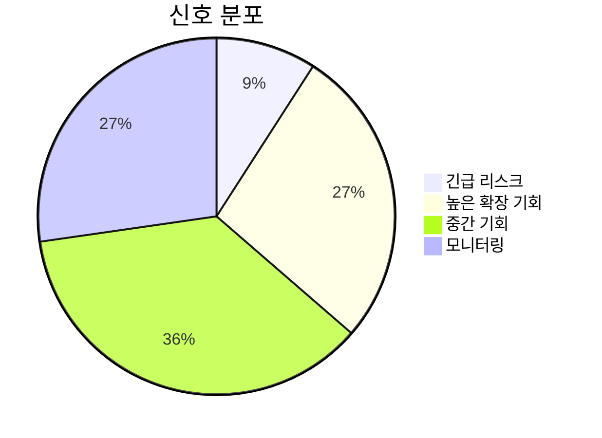
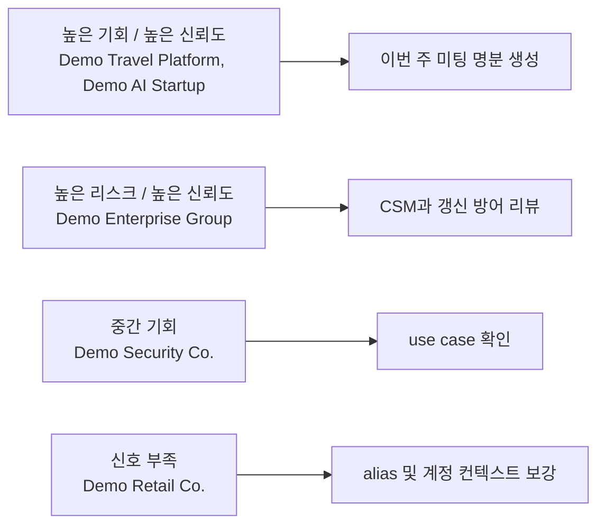
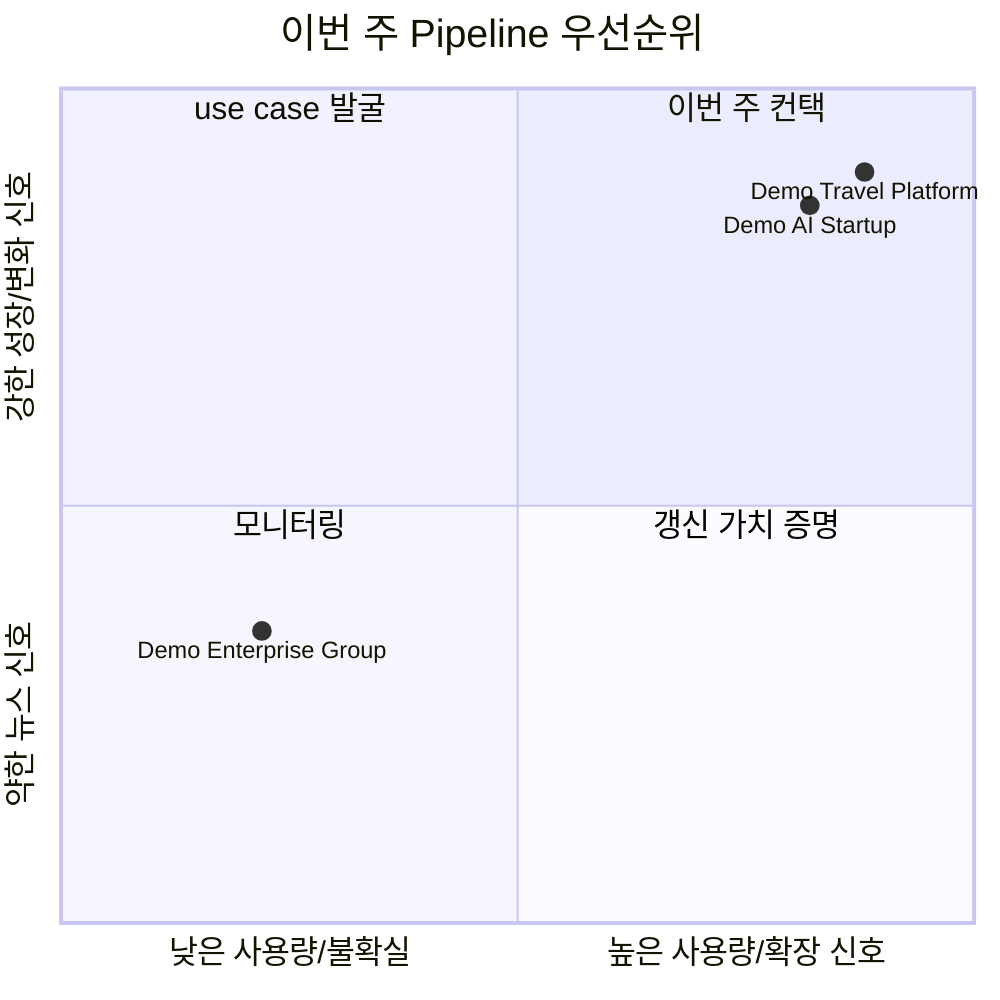

# Visual Summary Template

Use compact visuals in Markdown reports when reviewing more than 3 accounts. Prefer visuals that help an AE decide what to do next.

## Priority Table

```markdown
| 우선순위 | 고객사 | 플랜 | 사용량 신호 | 뉴스 신호 | 상업적 모션 | 긴급도 | 신뢰도 |
| ---: | --- | --- | --- | --- | --- | --- | --- |
| 1 | Demo Enterprise Group | Enterprise | 880/1200 low utilization | 어트리션 리스크 | 갱신 방어 | 높음 | 높음 |
| 2 | Demo AI Startup | Pro | 112/80 active > licensed | 글로벌 확장 | 사용자/워크스페이스 확장 | 높음 | 높음 |
```

## Signal Distribution

Use Mermaid pie charts for a quick executive view.



## Opportunity Matrix

Use Mermaid quadrant-style flowcharts when prioritizing AE follow-up.



## Pipeline Priority Matrix

Use this when the goal is creating qualified pipeline.



## Account Cards

Use short card-like bullets for Slack summaries or executive snapshots.

```markdown
> **Demo AI Startup** | Pro | 확장 기회: 높음  
> 글로벌 AI 제품 출시와 해외 파트너십 확대. 사용자/워크스페이스 확장, 글로벌 협업, 규제 대응 use case 확인.
```

## Usage Snapshot

Use this table when usage data is available.

```markdown
| 고객사 | 계약 인원 | 사용 인원 | 사용량 신호 | 해석 |
| --- | ---: | ---: | --- | --- |
| Demo AI Startup | 80 | 112 | active > licensed | true-up 또는 추가 seat 확인 |
| Demo Travel Platform | 360 | 409 | high utilization | 갱신 가치 증명 및 확장 readiness |
| Demo Enterprise Group | 1200 | 880 | low utilization | 리스크 기사와 함께 갱신 방어 |
```

## Rules

- Keep visuals close to the top of the report.
- Do not use visuals that require external image hosting.
- Use Mermaid, Markdown tables, or simple text cards by default.
- Use generated bitmap infographics only when the user explicitly asks for an image file.
- Keep chart labels Korean and short.
