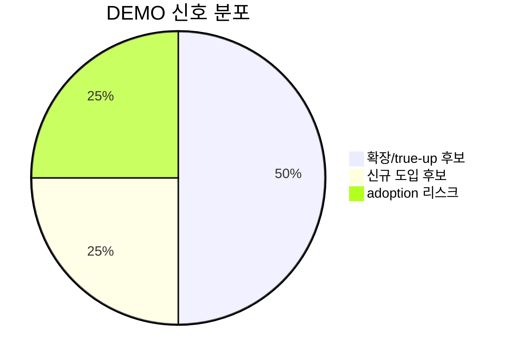
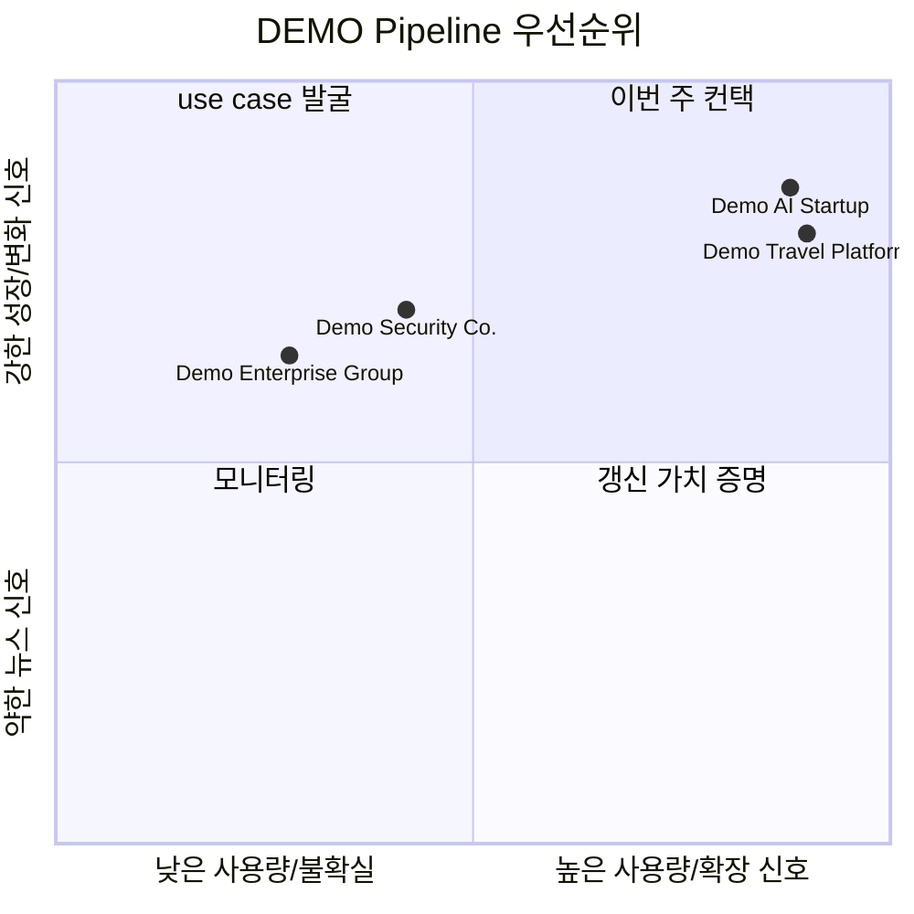

# DEMO - Slack 고객사 뉴스+사용량 인텔리전스 검증 리포트

실행일: 2026-05-16  
대상: `slack-account-news-intel-demo`의 mock 고객사 4개  
목적: Skillathon 제출용 데모 스킬이 Markdown 리포트와 Slack 복붙용 요약을 재현 가능하게 생성하는지 검증  
주의: 본 리포트의 고객사명, Slack 플랜, 계약 인원, 사용 인원은 모두 데모용 mock data입니다. 공개 뉴스와 산업 신호는 데모 시나리오를 구성하기 위한 참고 자료이며, 실제 고객 관계나 실제 Slack 사용 현황을 의미하지 않습니다.

## 한눈에 보기

- 이번 주 Pipeline 후보: 3개
- 확장/true-up 후보: 2개
- 신규 도입 또는 유료 전환 후보: 1개
- adoption / attrition 리스크 후보: 1개
- 선택 확장 항목: Notion 저장 또는 Slack 공유 workflow로 확장 가능



## 이번 주 Pipeline 후보 Top 4

| 순위 | 고객사 | 플랜 | 사용량 | 등급 | 후킹 포인트 | 추천 모션 | 컨택 타이밍 | 첫 액션 |
| ---: | --- | --- | ---: | --- | --- | --- | --- | --- |
| 1 | Demo Travel Platform | Business+ | 360 / 409 | A | 여행/예약/파트너 운영 확대 시나리오 + active > licensed | true-up 확인 + Enterprise+ 검토 | 이번 주 | 글로벌/파트너 협업 use case 확인 |
| 2 | Demo AI Startup | Pro | 80 / 112 | A | AI 제품 출시/행사 참여/투자 유치 시나리오 + active > licensed | Business+ 또는 Enterprise+ 검토 | 이번 주 | AI 프로젝트룸/고객 PoC 협업 확인 |
| 3 | Demo Security Co. | Free | 0 / 0 | B | AI 보안/클라우드 생태계 성장 신호 | 유료 전환 또는 Business+ 검토 | 2주 내 | 보안 프로젝트 협업 현황 확인 |
| 4 | Demo Enterprise Group | Enterprise | 1200 / 880 | B-Risk | AX/DX 추진 신호가 있으나 사용률 낮음 | adoption recovery + 갱신 방어 | 이번 주 | 미사용 부서와 대체 도구 여부 확인 |



## 핵심 계정 분석

### 1. Demo Travel Platform / 데모트래블

- 현재 Slack 상태: 사용 중 / Business+
- 사용량: 계약 360명 / 사용 409명
- 사용량 신호: `active_users > licensed_users`
- Pipeline Fit: A
- 데모 뉴스 신호: 여행/예약 플랫폼이 글로벌 사업, 파트너 운영, AI 기반 고객 경험 개선을 확대하는 상황을 가정
- 해석: Business+에서 사용 인원이 계약 인원을 초과하는 mock 상황이므로, 실제 업무에서는 계약/사용량 정의 확인 후 true-up 또는 Enterprise+ 검토 대화로 연결할 수 있음.
- 추천 모션: true-up 확인, Enterprise+ 검토, Slack Connect 기반 파트너 협업, AI 운영 workflow 확인.
- 첫 메시지:
  ```text
  안녕하세요, 최근 글로벌 여행/파트너 운영 확대 관련 소식을 보고 연락드렸습니다.
  예약, 숙박, 투어, 고객지원 조직이 함께 움직이는 시점에는 Slack에서 내부 조직과 외부 파트너 협업 구조를 점검해볼 필요가 있을 것 같습니다.
  현재 데모 데이터상 사용 인원이 계약 인원을 초과하는 상태로 보여, Business+ 사용 범위와 Enterprise+ 검토 포인트를 함께 확인해보면 좋겠습니다.
  ```
- 참고 공개 신호: AI 도입과 업무 현장 적용을 다루는 AI TECH 2026 행사 보도, StartupRecipe, 2026-05-04: https://startuprecipe.co.kr/archives/5815625

### 2. Demo AI Startup / 데모AI

- 현재 Slack 상태: 사용 중 / Pro
- 사용량: 계약 80명 / 사용 112명
- 사용량 신호: `active_users > licensed_users`
- Pipeline Fit: A
- 데모 뉴스 신호: AI 제품 출시, 투자 유치, 고객 PoC 증가, AI 행사 참여를 가정
- 해석: Pro 고객에서 사용량 초과와 AI 사업 확장 신호가 동시에 있으면 Business+ 또는 Enterprise+ 대화 명분이 강함.
- 추천 모션: Business+ 또는 Enterprise+ 검토, 고객 프로젝트룸, 영업/CS/제품 협업, Slack Connect 확인.
- 첫 메시지:
  ```text
  안녕하세요, 최근 AI 제품 확장과 고객 PoC 증가 관련 소식을 보고 연락드렸습니다.
  AI 제품이 실제 고객 프로젝트로 확산되면 제품, 엔지니어링, 영업, 고객지원 조직의 협업 방식도 빠르게 바뀌는 경우가 많습니다.
  현재 데모 데이터상 사용 인원이 계약 인원을 초과하고 있어, Business+ 또는 Enterprise+ 관점에서 함께 점검해볼 부분이 있을 것 같습니다.
  ```
- 참고 공개 신호: 2026 블록체인 AI 해커톤 및 AI 기반 서비스 발굴 보도, 아시아경제, 2026-05-04: https://www.asiae.co.kr/article/2026050410210725170

### 3. Demo Security Co. / 데모보안

- 현재 Slack 상태: 미사용 또는 Free
- 사용량: 계약 0명 / 사용 0명
- 사용량 신호: no paid usage
- Pipeline Fit: B
- 데모 뉴스 신호: AI 보안, 클라우드 파트너십, 보안 자동화 수요 증가를 가정
- 해석: Free 또는 미사용 고객이 보안/클라우드/AI 생태계에서 성장 신호를 보이면 신규 유료 전환 또는 Business+ 검토 후보로 볼 수 있음.
- 추천 모션: 유료 전환, Business+ 검토, 보안 프로젝트 협업, incident response channel, 외부 파트너 협업 확인.
- 첫 메시지:
  ```text
  안녕하세요, 최근 AI 보안과 클라우드 보안 협업 관련 흐름을 보며 연락드렸습니다.
  보안 프로젝트는 내부 대응팀, 외부 파트너, 고객 커뮤니케이션이 동시에 움직이는 경우가 많아 협업 채널의 보안과 관리가 중요해질 수 있습니다.
  현재 Slack을 어떤 팀에서 어떻게 사용하고 계신지, 또는 아직 검토 전인지 짧게 확인해보고 싶습니다.
  ```
- 참고 공개 신호: AWS의 AI·클라우드 생태계 확대 및 기업용 AI 전략 보도, 파이낸셜뉴스, 2026-01-07: https://www.fnnews.com/news/202601070701323683

### 4. Demo Enterprise Group / 데모그룹

- 현재 Slack 상태: 사용 중 / Enterprise
- 사용량: 계약 1200명 / 사용 880명
- 사용량 신호: low utilization
- Pipeline Fit: B-Risk
- 데모 뉴스 신호: AX/DX 전환, 제조/현장 자동화, AI Native 운영 모델 도입을 가정
- 해석: Enterprise 고객은 이미 상위 플랜이므로 단순 플랜 업셀로 표현하면 안 됨. 사용률이 낮은 상태에서는 확장보다 adoption recovery와 갱신 가치 증명이 우선임.
- 추천 모션: adoption recovery, 부서별 사용 현황 점검, AX 프로젝트 협업 use case 발굴, 갱신 방어.
- 첫 메시지:
  ```text
  안녕하세요, 최근 AX/DX 전환과 AI 기반 업무 환경 확대 관련 소식을 보고 연락드렸습니다.
  전사 프로젝트가 늘어나는 시점에는 Slack이 어떤 부서에서 실제로 쓰이고 있고, 어떤 부서는 아직 활용이 낮은지 확인하는 것이 중요할 수 있습니다.
  현재 데모 데이터상 사용률이 낮게 보여 갱신 전에 핵심 use case와 adoption 지원이 필요한 영역을 함께 점검해보면 좋겠습니다.
  ```
- 참고 공개 신호: AW 2026에서 AX 산업 전환 및 제조 현장 AI 전환을 다룬 보도, 세계비즈, 2026-03-04: https://m.segyebiz.com/newsView/20260304520485
- 참고 공개 신호: 포스코DX의 AW 2026 AX 전시 및 AI Native 업무 환경 소개, 포스코그룹 뉴스룸, 2026-04: https://newsroom.posco.com/kr/aw-2026-%ED%95%B5%EC%8B%AC-%EC%9A%94%EC%95%BD-%ED%8F%AC%EC%8A%A4%EC%BD%94dx%EA%B0%80-%EB%B0%94%EA%BF%80-%EC%A0%9C%EC%A1%B0-%ED%98%84%EC%9E%A5%EC%9D%98-%EB%AF%B8%EB%9E%98/

## 이번 주 AE 액션 아이템

1. Demo Travel Platform과 Demo AI Startup은 `active_users > licensed_users` mock 신호가 있으므로 true-up 정의 확인과 확장 대화로 연결.
2. Demo Security Co.는 Free/new-logo 시나리오로 두고, 보안 프로젝트 협업과 유료 전환 fit을 확인.
3. Demo Enterprise Group은 Enterprise 고객이므로 플랜 업셀이 아니라 adoption recovery, 갱신 방어, AX 프로젝트 use case 발굴로 접근.
4. 실제 업무 적용 시에는 mock plan/usage를 내부 고객 데이터로 교체하고, 공개 뉴스 검색 결과와 함께 동일한 절차를 실행.

## Slack 복붙용 요약

```markdown
*[DEMO] Slack 고객사 뉴스+사용량 인텔리전스 테스트*

주의: 고객사명, 플랜, 사용량은 모두 mock data입니다. 공개 뉴스/산업 신호를 활용해 스킬 흐름만 검증했습니다.

*이번 주 Pipeline 후보*
- *Demo Travel Platform* | Business+ | 계약 360 / 사용 409 | Pipeline Fit A
  - 액션: true-up 정의 확인 + Enterprise+ / Slack Connect 검토
- *Demo AI Startup* | Pro | 계약 80 / 사용 112 | Pipeline Fit A
  - 액션: Business+ 또는 Enterprise+ 검토. AI 고객 프로젝트룸/PoC 협업 확인
- *Demo Security Co.* | Free | Pipeline Fit B
  - 액션: 보안 프로젝트 협업 기반 유료 전환 가능성 확인

*리스크 후보*
- *Demo Enterprise Group* | Enterprise | 계약 1200 / 사용 880
  - 액션: 플랜 업셀보다 adoption recovery와 갱신 가치 증명 우선

*검증 결과*
- Markdown 리포트 생성 가능
- 차트/표/후킹 메시지 생성 가능
- Notion 저장 또는 Slack 공유는 선택 확장 항목
```

## 검증 메모

- 데모 스킬 구조 검증: 통과
- mock customer data 사용: 통과
- 실제 고객사명/실제 사용량 미포함: 통과
- Markdown 리포트 생성: 통과
- Slack 복붙용 요약 생성: 통과
- Notion 저장: 제출 필수 범위 밖의 선택 확장 항목
